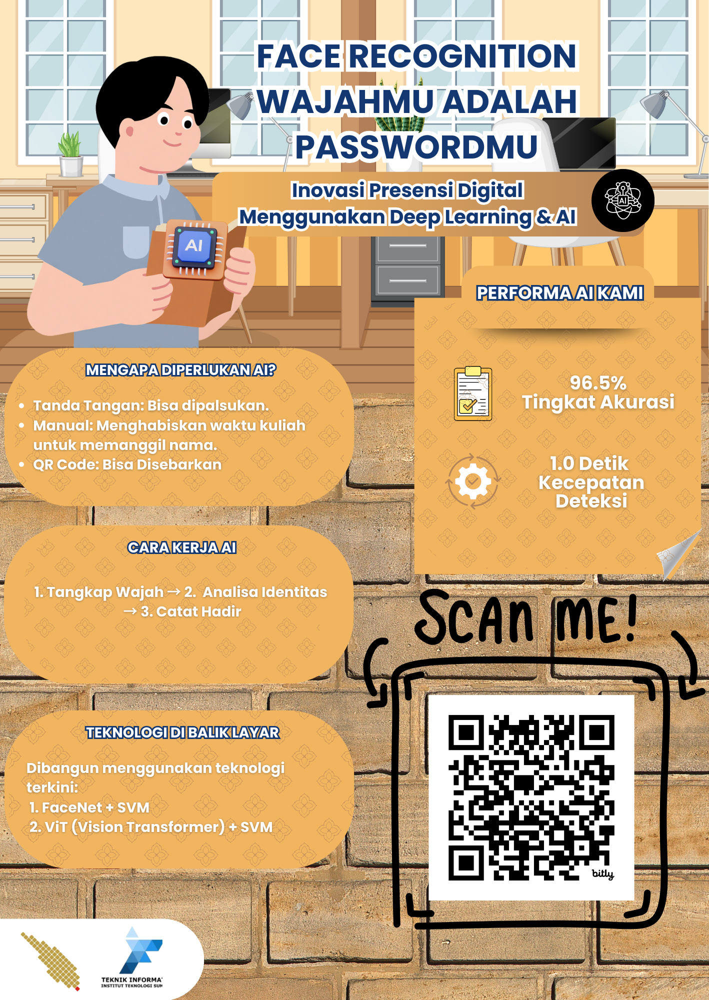

# 🎓 Face Recognition Berbasis Hybrid Deep Learning

**Tugas Besar Mata Kuliah Deep Learning**  
Program Studi Teknik Informatika - Institut Teknologi Sumatera (2025)

---

## 📢 Presentasi Proyek



### 🌐 Demo & Resources

- 🚀 **Live Demo**: [Coba Aplikasi Sekarang](https://tubes-deeplearning-face-marafa.streamlit.app/)
- 🤗 **Model Repository**: [Hugging Face Hub](https://huggingface.co/Martua/tubes-deeplearning/tree/main)

---

## 👥 Tim Pengembang (MaRaFa)

| NIM | Nama | Peran |
|-----|------|-------|
| 122140119 | Martua Kevin A.M.H. Lubis | AI Engineer & Model Training |
| 122140236| Rayhan Irwanto | Data Analyst |
| 122140205| Muhammad Fadil Ataullah Rifqi | Application Developer (Streamlit) |

---

## 📖 Latar Belakang & Masalah

Tugas besar ini menantang kami untuk membangun sistem Face Recognition End-to-End dengan kendala utama:

- **Keterbatasan Data (Few-Shot Learning)**: Setiap individu hanya memiliki 4 sampel foto wajah
- **Risiko Overfitting**: Melatih Deep CNN dari nol dengan data sesedikit ini menyebabkan model menghafal background/baju, bukan wajah

---

## 🚀 Solusi: Hybrid Transfer Learning

Kami mengajukan pendekatan **Hybrid** yang menggabungkan kekuatan Deep Learning modern dengan Machine Learning klasik:

### Komponen Utama:

1. **Face Detection**: MTCNN (Multi-task Cascaded Convolutional Networks)
   - Mendeteksi dan memotong (crop) wajah secara presisi
   - Menghilangkan noise background

2. **Feature Extraction**: InceptionResnetV1 (Pre-trained VGGFace2)
   - Model telah dilatih pada jutaan wajah
   - Mengubah citra wajah menjadi vektor numerik (embedding) yang kaya fitur

3. **Classification**: SVM dengan Kernel Linear
   - Superior dalam menemukan hyperplane pemisah optimal pada dataset kecil
   - Ideal untuk Small Data Regime

---

## 🔬 Metodologi & Eksperimen

### 1. Data Preprocessing (Augmentasi Offline)

Karena data asli sangat terbatas (4 foto/kelas), kami melakukan augmentasi offline untuk memperkaya data latih menjadi **44 foto/kelas**.

**Teknik Augmentasi:**
- Random Rotation (-20° hingga 20°)
- Horizontal Flip
- Brightness Adjustment
- Contrast Adjustment

**Tujuan:** Membuat model SVM lebih robust terhadap perubahan pencahayaan dan posisi kepala.

### 2. Perbandingan Model (Benchmark)

| Model | Metode | Akurasi Validasi | Keterangan |
|-------|--------|-----------------|-----------|
| **Facenet + SVM** | Transfer Learning | **94.34%** | 🏆 DIPILIH (Best Trade-off) |
| Vision Transformer (ViT) | Fine-Tuning | 100%* | Overfitting pada background |
| EfficientNet-B0 | Fine-Tuning | 56.14% | Kesulitan konvergensi |
| MobileNetV2 | Fine-Tuning | 53.70% | Underfitting |

**Catatan:** Meskipun ViT mencapai 100% pada validasi augmented, performanya menurun drastis pada data "Real World". Facenet + SVM dipilih karena generalisasi yang lebih baik.

---

## 🛠️ Fitur Aplikasi

Aplikasi dibangun dengan **Streamlit** dan menyediakan:

- ✅ **Dual Input**: Webcam (Live) dan Upload File
- ✅ **Auto-Crop Visualization**: Menampilkan hasil potongan wajah MTCNN
- ✅ **Confidence Threshold**: Slider untuk mengatur sensitivitas sistem
- ✅ **Auto-Download Model**: Mengunduh model dari Cloud otomatis jika belum ada

---

## 💻 Cara Menjalankan (Instalasi)

### 1. Clone Repository

```bash
git clone https://github.com/martuakevin/tubes-deeplearning-face.git
cd tubes-deeplearning-face
```

### 2. Install Dependencies

Pastikan **Python 3.8+** sudah terinstall.

```bash
pip install -r requirements.txt
```

### 3. Jalankan Aplikasi

```bash
python -m streamlit run appfinal.py
```

---

## 📂 Struktur File

```
tubes-deep-learning-face/
├── 📁 models/
│   ├── face_svm_augmented.pth      # Model SVM (Didownload otomatis)
│   ├── face_vit_svm_augmented.pth  # Model ViT alternatif
│   └── labels_augmented.txt        # Label kelas untuk prediksi
├── 📁 notebooks/
│   └── Final_Tubes.ipynb           # Jupyter Notebook eksperimen & training
├── appfinal.py                     # Main Application Code (Streamlit)
├── requirements.txt                # List Library Python
├── README.md                       # Dokumentasi Proyek (file ini)
└── .gitignore                      # File/folder yang diabaikan Git
```

### Penjelasan File Penting:

| File | Fungsi |
|------|--------|
| `appfinal.py` | Aplikasi Streamlit utama untuk face recognition |
| `models/face_svm_augmented.pth` | Model SVM terlatih (94.34% akurasi) |
| `models/labels_augmented.txt` | Daftar label kelas yang dikenali sistem |
| `notebooks/Final_Tubes.ipynb` | Notebook lengkap: preprocessing, training, evaluasi |
| `requirements.txt` | Dependensi Python yang diperlukan |

---

## 📢 Kredit & Referensi

- **Facenet-PyTorch**: Tim Esler (Github)
- **Dataset**: Koleksi Pribadi Mahasiswa ITERA (Tugas Besar Deep Learning 2025)
- **Paper Acuan**: [FaceNet: A Unified Embedding for Face Recognition and Clustering](https://arxiv.org/abs/1503.03832) (Schroff et al., 2015)
- **Model Hosting**: [Hugging Face Model Hub](https://huggingface.co/Martua/tubes-deeplearning/tree/main)

---

**Dibuat dengan ❤️ dan ☕ oleh Kelompok Martua, Rayhan, Fadil.**